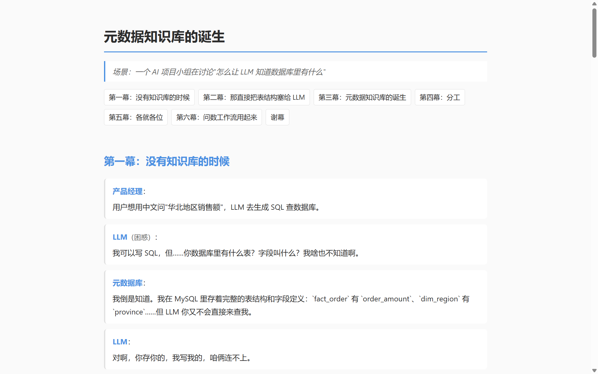
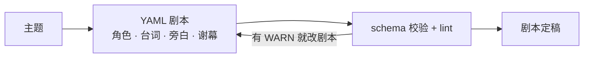
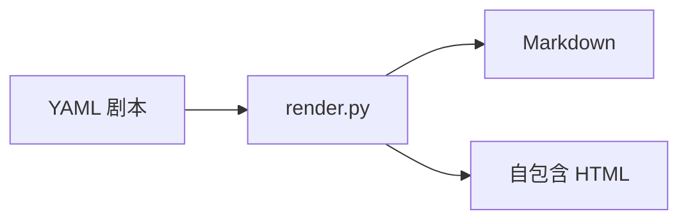

# MiniPlay

> 把复杂的技术概念、架构、流程，变成一场人人看得懂的小剧场。


[简介](#这是什么) · [理念](#核心理念) · [工作流](#工作流) · [安装](#安装) · [快速开始](#快速开始) · [DSL](#dsl-一瞥) · [示例](#示例剧本) · [CLI](#渲染器-cli) · [边界](#设计边界)



## 这是什么

MiniPlay 是一组 [Claude Code](https://code.claude.com) skill，用**角色扮演对话**来解释技术概念。

它不是聊天记录整理器，而是一套剧本 DSL：角色、台词、旁白、代码块、谢幕总结都是结构化字段，能校验、能 lint、能渲染成任意格式。由两个解耦的 skill 组成：

| Skill | 职责 |
|---|---|
| `mini-play` | **创作** —— 把主题写成结构化 YAML 剧本 |
| `mini-play-render` | **渲染** —— 把 DSL 渲染成 Markdown 或自包含 HTML |

适合这些场景：

- 技术博主想把一篇教程写成有人物、有冲突的图文
- 团队内部分享，要把架构、流程讲得有趣味性
- 教学：把抽象概念放进对话，让矛盾推动理解，一步步引出新的概念

## 核心理念

### 剧本即源码

YAML 剧本是唯一真相，Markdown / HTML 都是渲染产物。校验失败只影响渲染，不会破坏剧本本身；改了剧本随时重新渲染，就像改了源码重新编译。

### 对话优于陈述

概念的产生是矛盾推动的。知识盲区、常见误区、方案之争写成角色间的冲突，读者跟着矛盾推进剧情；谢幕表最后把散落的要点收拢成一张总结表。

## 工作流

**`mini-play`（创作）：**



**`mini-play-render`（渲染）：**



## 安装

依赖：Python ≥ 3.10，以及 `pydantic` / `jinja2` / `pyyaml`：

```bash
pip install -r requirements.txt
```

### 方式一：Plugin（推荐）

在 Claude Code 中执行：

```
/plugin marketplace add Canyon-Li/Mini-Play
/plugin install mini-play@Mini-Play
```

### 方式二：手动安装

把 `skills/` 下的两个目录复制到 `~/.claude/skills/`：

```bash
git clone https://github.com/Canyon-Li/Mini-Play.git
cp -r Mini-Play/skills/mini-play Mini-Play/skills/mini-play-render ~/.claude/skills/
```

> 两个 skill 需要一起安装：`mini-play-render` 会调用 `mini-play` 目录里的渲染器。

## 快速开始

```
/mini-play RAG 检索中的重排序
```

Claude 会产出一个 YAML 剧本（角色档案、分幕、台词、旁白、谢幕表），然后按需渲染：

```
/mini-play-render html <剧本路径>       # 自包含 HTML，离线可开
/mini-play-render markdown <剧本路径>
```

## DSL 示例

```yaml
title: 元数据知识库的诞生
scene: 一个 AI 项目小组在讨论"怎么让 LLM 知道数据库里有什么"
characters:
  - name: LLM
    persona: 会写 SQL 但不知道数据库里有什么的 AI
    aliases: [大模型]
    backstory: 上下文窗口有限，吃不下整库的原始元数据。
acts:
  - title: 第一幕：没有知识库的时候
    beats:
      - type: line
        who: LLM
        emotion: 困惑
        text: 我可以写 SQL，但……你数据库里有什么表？
      - type: aside
        variant: insight
        text: 为什么需要这步 —— ……
closing:
  table:
    headers: [角色, 做什么]
    rows: [[LLM, 写 SQL]]
  thesis: 一句话点题
```

共 6 种 beat：`line`（台词）/ `thought`（内心独白）/ `stage_direction`（舞台说明）/ `aside`（旁白）/ `code`（代码块）/ `transition`（转场）。完整 schema 见 [skills/mini-play/SKILL.md](skills/mini-play/SKILL.md)，由 [schema.py](skills/mini-play/schema.py) 的 pydantic 模型强制校验（角色引用完整性、beat 必填字段、防 typo 等）。

## 示例剧本

| 剧本 | 规模 | 内容 |
|---|---|---|
| [元数据知识库的诞生](skills/mini-play/plays/元数据知识库的诞生.yaml) | 8 角色 | 构建阶段：三套索引如何分工 |
| [LLM的12步喂饭之旅](skills/mini-play/plays/LLM的12步喂饭之旅.yaml) | 2 角色 / 9 幕 | 查询阶段：一次 Text2SQL 的完整旅程 |

渲染成 Markdown 长这样（节选自《元数据知识库的诞生》第一幕）：

```markdown
## 第一幕：没有知识库的时候

**产品经理：** 用户想用中文问"华北地区销售额"，LLM 去生成 SQL 查数据库。

**LLM（困惑）：** 我可以写 SQL，但……你数据库里有什么表？字段叫什么？我啥也不知道啊。

**元数据库：** 我倒是知道。我在 MySQL 里存着完整的表结构和字段定义……

**问题：** LLM 不知道数据库长什么样，盲写 SQL。
```

渲染出的 HTML 是**自包含单文件**（内联 CSS/JS，离线可开），支持：

- 点击角色名弹出**角色卡**（人设 / 别名 / 背景 / 登场幕次）
- 旁白（note / warning / insight）默认折叠，不打断剧情
- 幕间导航、深色主题（`render_meta.html.theme: dark`）

## 渲染器 CLI

渲染器不依赖 Claude，可直接在命令行使用：

```bash
python skills/mini-play/schema.py <剧本.yaml>            # 只校验
python skills/mini-play/render.py html <剧本.yaml>       # 渲染 HTML
python skills/mini-play/render.py markdown <剧本.yaml>   # 渲染 Markdown
python skills/mini-play/render.py html <剧本.yaml> --out out/x.html
```

## 设计边界

当前支持：

- Markdown / HTML 两种渲染目标
- 中文情绪枚举（`emotion` 字段）
- Python 3.10+

暂不支持：

- PDF / Slides 等渲染目标
- 英文情绪枚举
- 多语言剧本

## 卸载

- Plugin 方式：在 Claude Code 中执行 `/plugin uninstall mini-play@Mini-Play`。
- 手动方式：删除 `~/.claude/skills/` 下的 `mini-play` 和 `mini-play-render` 两个目录。
> PS: 你的剧本和渲染产物都在你自己的项目目录里，卸载不会一起删除。

## License

[MIT](LICENSE)
